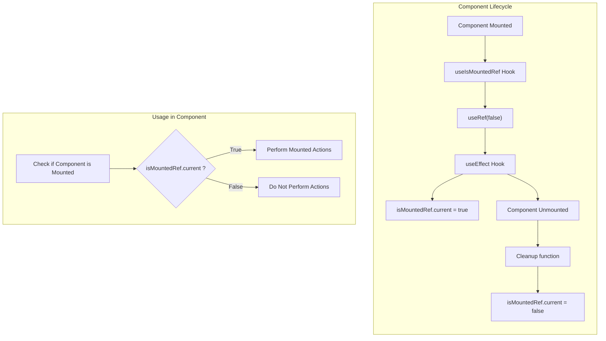

<div align="center">
  <h1>📦 use-is-mounted-ref</h1>

  <p><strong>React Hooks for mount state tracking and auto-cleanup with AbortController</strong></p>

<!-- prettier-ignore-start -->
[![build][build-badge]][build]
[![version][version-badge]][package]
[![MIT License][license-badge]][license]
[![downloads][downloads-badge]][npmtrends]
<!-- prettier-ignore-end -->

</div>

---

## Table of Contents

<!-- START doctoc generated TOC please keep comment here to allow auto update -->
<!-- DON'T EDIT THIS SECTION, INSTEAD RE-RUN doctoc TO UPDATE -->

- [Motivation](#motivation)
- [Installation](#installation)
- [Hooks](#hooks)
  - [useIsMountedRef](#useismountedref)
  - [useAbortController](#useabortcontroller)
- [Migration from v1 to v2](#migration-from-v1-to-v2)
- [Component Lifecycle Overview](#component-lifecycle-overview)
- [Contributing](#contributing)
- [Bugs and Sugestions](#bugs-and-sugestions)
- [License](#license)

<!-- END doctoc generated TOC please keep comment here to allow auto update -->

## Motivation

- Avoid memory leaks setting states when component are unmounted
- Automatically cancel fetch requests on unmount with AbortController
- Control when component is mounted
- Common error when setting state to unmounted component:

```js
Warning: Can only update a mounted or mounting component. This usually means you called setState, replaceState, or forceUpdate on an unmounted component. This is a no-op.
```

## Installation

```bash
yarn add use-is-mounted-ref
# or
npm install use-is-mounted-ref
```

## Hooks

### useIsMountedRef

Track component mount state with a ref.

**Example: Avoid setState when unmounted**

```jsx
import { useState, useEffect } from 'react';
import { useIsMountedRef } from 'use-is-mounted-ref';

function App() {
  const isMountedRef = useIsMountedRef();
  const [state, setState] = useState({
    loading: true,
    error: false,
    data: [],
  });

  useEffect(() => {
    fetch('https://api.example.com/data')
      .then((response) => response.json())
      .then(({ data }) => {
        if (isMountedRef.current) {
          setState((prev) => ({ ...prev, loading: false, data }));
        }
      })
      .catch((err) => {
        if (isMountedRef.current) {
          setState((prev) => ({ ...prev, loading: false, error: true }));
        }
      });
  }, [isMountedRef]);

  return state.loading ? 'Loading...' : 'Found Data!';
}
```

### useAbortController

Automatically abort fetch requests and async operations on unmount.

**Example: Auto-cancel fetch on unmount**

```jsx
import { useState, useEffect } from 'react';
import { useAbortController } from 'use-is-mounted-ref';

function App() {
  const abortController = useAbortController();
  const [data, setData] = useState(null);

  useEffect(() => {
    fetch('https://api.example.com/data', {
      signal: abortController.signal,
    })
      .then((response) => response.json())
      .then(setData)
      .catch((err) => {
        if (err.name !== 'AbortError') {
          console.error(err);
        }
      });
  }, [abortController]);

  return <div>{data ? 'Loaded!' : 'Loading...'}</div>;
}
```

**Example: Combine both hooks**

```jsx
import { useState, useEffect } from 'react';
import { useIsMountedRef, useAbortController } from 'use-is-mounted-ref';

function App() {
  const isMountedRef = useIsMountedRef();
  const abortController = useAbortController();
  const [state, setState] = useState({ loading: true, data: null });

  useEffect(() => {
    fetch('https://api.example.com/data', {
      signal: abortController.signal,
    })
      .then((res) => res.json())
      .then((data) => {
        if (isMountedRef.current) {
          setState({ loading: false, data });
        }
      })
      .catch((err) => {
        if (err.name !== 'AbortError' && isMountedRef.current) {
          setState({ loading: false, data: null });
        }
      });
  }, [abortController, isMountedRef]);

  return state.loading ? 'Loading...' : 'Loaded!';
}
```

## Migration from v1 to v2

**Breaking change:** Default export replaced with named exports.

```diff
- import useIsMountedRef from 'use-is-mounted-ref';
+ import { useIsMountedRef } from 'use-is-mounted-ref';
```

New hook available:

```js
import { useAbortController } from 'use-is-mounted-ref';
```

## Component Lifecycle Overview



## Contributing

Please read [CONTRIBUTING.md](CONTRIBUTING.md) for details on our code of conduct, and the process for submitting pull requests to us.

## Bugs and Sugestions

Report bugs or do suggestions using the [issues](https://github.com/helderberto/use-is-mounted-ref/issues).

## License

[MIT License](LICENSE) © [helderberto](https://helderberto.com)

<!-- prettier-ignore-start -->
[version-badge]: https://img.shields.io/npm/v/use-is-mounted-ref.svg?style=flat-square
[package]: https://www.npmjs.com/package/use-is-mounted-ref
[downloads-badge]: https://img.shields.io/npm/dm/use-is-mounted-ref.svg?style=flat-square
[npmtrends]: http://www.npmtrends.com/use-is-mounted-ref
[license-badge]: https://img.shields.io/npm/l/use-is-mounted-ref.svg?style=flat-square
[license]: https://github.com/helderberto/use-is-mounted-ref/blob/master/LICENSE
[build]: https://github.com/helderberto/use-is-mounted-ref/actions
[build-badge]: https://github.com/helderberto/use-is-mounted-ref/actions/workflows/ci.yml/badge.svg
<!-- prettier-ignore-end -->
